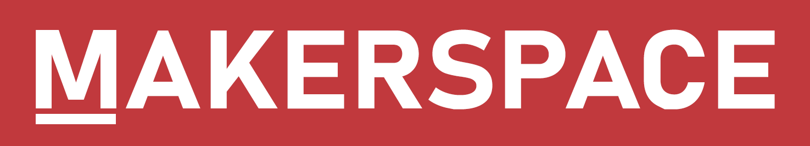

<p align="center">
  
</p>
<h1 align="center">
  UTDesign Makerspace Website
</h1>
<h3 align="center">
  The official homepage, blog, calendar, and store for UTDesign Makerspace.
</h3>

## 💻 Development

1.  **Start developing.**

    Navigate into your new site’s directory and start it up.

    ```shell
    cd Makerspace-Home/
    npm run develop
    ```

1.  **Open the code and start programming!**

    Your site is now running at http://localhost:8000!

    Edit a page in `src/pages/` or a blog post `src/blog/` to see the site update in real-time!

## ✏️ Posting to the Blog

1.  **Open the admin panel.**

    If you do not have access to the admin panel, please contact the current president. Once you have access, navigate to http://utd.ms/admin/ to access the admin panel. Sign in using your GitHub account.

1.  **Create a new post.**

    Once you are signed in, click the "New Blog" button near the top of the page. Fill out the form with the appropriate information. Preview your post using the panel on the right. Once you are done, click "Save" to save your post as a draft.

1.  **Contact the president.**

    Once you have saved your post, contact the current president to have them review and publish your post.
