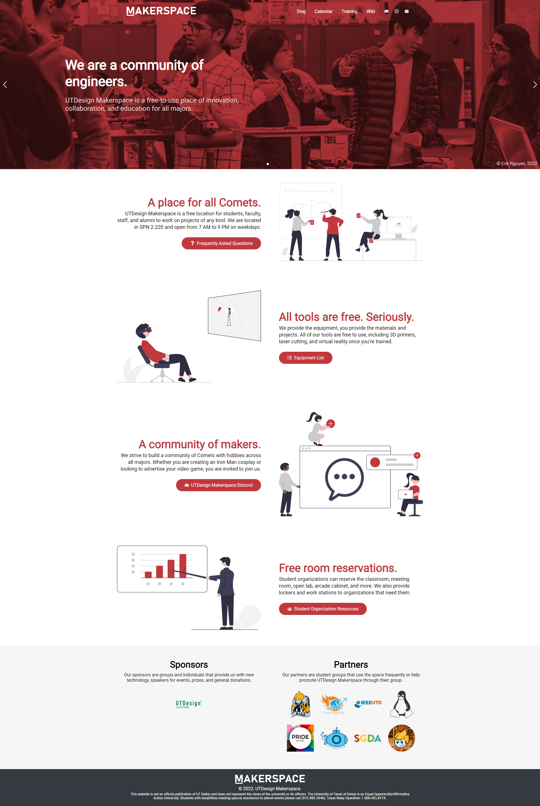
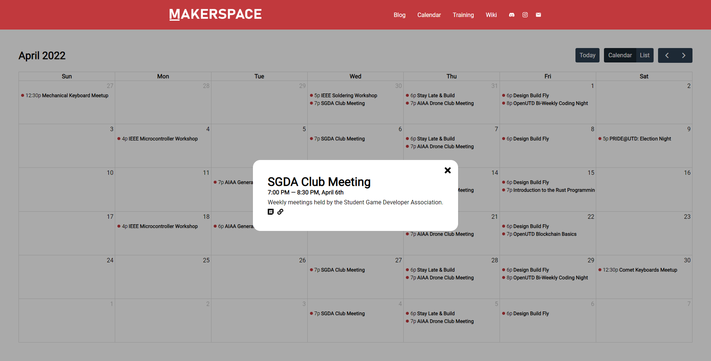

<!---
Make sure you follow these rules while writing:
1) Make sure your date follows the YEAR-MONTH-DAY format, preferably with leading zeroes.
2) Use image credits or subtitles when possible. For example: 

Some notes:
• H1 (#) and H2 (##) have the same font-size to avoid conflicting with the title of the page.
-->

# New homepage

The UTDesign Makerspace website has received a new look altogether. However, one section that was a big focus for us was the homepage. This is our first impression on Comets hearing about us for the first time, so we wanted to make sure we present ourselves well.

- Our branding has been updated. This includes new fonts, colors, and logos.
- A new hero showcases images and taglines inspired by the various hobbies that make up our community. Special thanks to Erik Nguyen, the Student Game Developer Association, and Thomas Cortez for the first lineup of images!
- Open-source illustrations from unDraw and links to important pages have been added to our services section.
- The calendar section has been moved to its own page to allow it the space it deserves.
- The FAQ section has been removed as we prefer members refer to the wiki for the most up to date information.
- A list of sponsors and partners has been added.

# New calendar

Our calendar has also been adjusted to have a modern look. We attempted to improve the calendar by improving its usability and giving it more space on our website.

- The calendar now has its own webpage so it can take up the full browser.
- Viewing the calendar on mobile now shows a list of events rather than a grid.
- Buttons in event modals are now icons. This should save space and make the modal look modern compared to its previous design.
- All events now have download and Google Calendar buttons, allowing members to easily add events in the Makerspace to their own calendars.

# More to come

This is only one of many announcements regarding changes we're making over the summer. Many things are coming, like a new look in the open lab and the release of the Makerspace Arcade. Stay tuned in our Discord server for more updates like this one!
